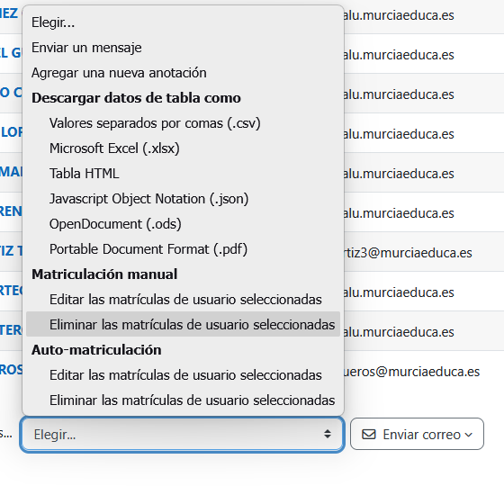

# Procedimiento anual para reutilizar un curso Moodle

El objetivo es **reutilizar el mismo curso Moodle con una nueva promoción**, conservando en la plataforma los datos de los alumnos antiguos —entregas, intentos, calificaciones, etc.— aunque estén desmatriculados, y aprovechar la función **Reiniciar** únicamente para desplazar las fechas de las actividades al nuevo curso académico.

La copia de seguridad tendrá una función secundaria: debido a los permisos de nuestro Moodle, **no puede incluir datos de los usuarios**, por lo que servirá para conservar la estructura y los materiales del curso, pero no como respaldo de las entregas y calificaciones del alumnado.

# 1. Resumen de tareas

1. **Exportar las calificaciones.**
2. **Crear opcionalmente una copia de seguridad del curso.**
3. Desmatricular al alumnado antiguo. **PELIGRO!! No te desmatricules a ti mismo, perderás el curso...**
4. **Corregir la fecha de inicio del curso anterior.**
5. **Reiniciar únicamente la fecha de inicio.**
6. **Comprobar el desplazamiento de las fechas.**
7. **Matricular al alumnado del nuevo curso.**

---

# 2. Procedimiento detallado

## 1. Exportar las calificaciones

### Dónde está

En el curso:

**Calificaciones → Exportar**

Elegir preferentemente **Hoja de cálculo Excel** o, alternativamente, CSV.

### Qué hacer

Exportar las calificaciones antes de modificar el curso y guardar el archivo identificando claramente el módulo y el curso académico, por ejemplo:

`ED_2025-26_calificaciones.xlsx`

### Por qué

Esta será nuestra **copia histórica de consulta rápida de las calificaciones**.

Si meses después necesitamos comprobar una nota, será mucho más sencillo consultar este archivo que volver a matricular temporalmente al alumno.

Además, es especialmente importante en nuestro caso porque el profesor **no tiene permisos para incluir información de los usuarios en las copias de seguridad de Moodle**.

---

## 2. Crear opcionalmente una copia de seguridad del curso

### Dónde está

En el curso:

**Más → Reutilización del curso → Copia de seguridad**

### Qué hacer

Crear, si resulta conveniente, una copia `.mbz` con los elementos que Moodle permita incluir:

* actividades y recursos;
* archivos;
* bloques;
* banco de preguntas y cuestionarios;
* estructura de temas y secciones;
* configuración del curso.

En nuestro Moodle aparece una **cruz roja en «Incluir usuarios matriculados»**, por lo que nuestro rol no tiene permiso para incorporar los datos de usuario.

Después de generar la copia puede descargarse y almacenarse fuera de Moodle, por ejemplo:

`ED_2025-26_estructura.mbz`

### Para qué sirve y para qué no

Esta copia puede ser útil para **recuperar la estructura y los materiales del curso** si accidentalmente modificamos o eliminamos algo.

Pero debemos tener muy claro que **no es una copia histórica completa del curso 2025-26**, ya que no contiene los datos de los alumnos.

Por tanto, **no debemos confiar en este `.mbz` para recuperar entregas, intentos de cuestionarios o calificaciones**.

En nuestra estrategia, la conservación de esos datos dependerá fundamentalmente de mantenerlos en el propio Moodle después de desmatricular a los alumnos.

Por eso esta copia es **recomendable pero no imprescindible** para el cambio anual de promoción.

---

## 3. Desmatricular al alumnado del curso anterior

### Dónde está

Normalmente:

**Participantes**

y desde allí gestionar las matrículas.

La opción exacta puede depender del método de matriculación utilizado por el centro.

### Qué hacer

Desmatricular a todos los estudiantes de la promoción que acaba de terminar.

> PELIGRO! En aula virtual, en partcipantes, se pueden seleccionar todos los usuarios para desmatricularlos.
> PELIGRO! NO te desmatricules a ti mismo como profesor, ***perderás el acceso a tu curso!***
>
> 

No utilizar todavía ninguna opción de reinicio para eliminar datos.

### Por qué

Al desmatricularlos dejan de aparecer como participantes activos, dejando el aula preparada para los nuevos alumnos.

Además, hemos comprobado en nuestra instalación Moodle que, si posteriormente **volvemos a matricular al mismo alumno, reaparecen sus entregas y demás información**.

Esto nos proporciona un mecanismo muy útil ante una posible reclamación:

**rematricular temporalmente al alumno → consultar su historial → volver a desmatricularlo.**

Por este motivo es esencial que en los pasos posteriores **no eliminemos las entregas, intentos de cuestionario u otros datos históricos**.

---

# 4. Corregir la fecha de inicio del curso anterior

Este paso debe hacerse **antes de utilizar Reiniciar**.

### Dónde está

**Configuración → General → Fecha de inicio del curso**

### Qué hacer

Comprobar qué fecha tiene actualmente Moodle.

Si aparece la fecha actual o cualquier fecha que no corresponda al curso 2025-26, modificarla para que represente correctamente el comienzo del curso anterior.

Por ejemplo:

**1 de septiembre de 2025**

Guardar la configuración.

### Por qué

Moodle utiliza la fecha de inicio anterior como referencia para calcular cuánto debe desplazar las fechas.

El cálculo conceptual es:

**desplazamiento = nueva fecha de inicio − antigua fecha de inicio**

Por ejemplo, si Moodle tuviera erróneamente:

`Fecha antigua: 1/09/2026`

y durante el reinicio indicásemos:

`Nueva fecha: 1/09/2026`

el desplazamiento sería **0 días** y no conseguiríamos actualizar las actividades.

Por eso primero debemos asegurarnos de que la fecha inicial representa realmente el curso que estamos cerrando.

---

# 5. Reiniciar únicamente la fecha de inicio

### Dónde está

**Más → Reutilización del curso → Reiniciar**

### Qué hacer

En la sección **General**:

**Fecha de inicio del curso → Habilitar ✅**

e introducir la nueva fecha de referencia.

En principio dejar:

**Fecha de finalización → Habilitar ❌**

salvo que exista algún motivo concreto para modificarla.

## Elegir el desplazamiento temporal

En lugar de trasladar exactamente *365 días*:

`1/09/2025 → 1/09/2026`

puede resultar más útil desplazar **52 semanas = 364 días**:

`lunes 1/09/2025 → lunes 31/08/2026`

Así conservamos el **día de la semana** de las actividades.

Por ejemplo:

`viernes 17/10/2025 → viernes 16/10/2026`

Esto suele ser más útil académicamente que conservar exactamente el día y mes, porque las tareas y cuestionarios suelen estar relacionados con los días en que se imparte clase.

---

### 5.1 No borrar ningún dato histórico durante el reinicio

Este es el punto más importante del procedimiento.

En **Reiniciar**, debemos utilizar la herramienta **únicamente para modificar la fecha de inicio**.

Todas las opciones que impliquen borrar información deben quedar desmarcadas.

En las opciones que hemos visto en nuestro Moodle debemos asegurarnos especialmente de que estén **desmarcadas**:

**General**

* Eventos.
* Todas las anotaciones.
* Todos los comentarios.
* Datos de finalización.
* Asociaciones de blog.
* Valoraciones de la competencia.

**Roles**

* Dar de baja a usuarios: **No hay roles**.
* Todas las asignaciones de rol locales.
* Todas las modificaciones en el curso.

**Grupos**

* Todos los grupos.
* Todos los miembros de los grupos.
* Todos los agrupamientos.
* Todos los grupos de los agrupamientos.

**Tareas**

* **Todas las entregas.**
* Todas las excepciones de usuario.
* Todas las excepciones de grupo.

**Foros**

* Preferencias de usuario.
* Suscripciones.
* **Todos los mensajes.**

**Cuestionarios**

* **Todos los intentos de resolver el cuestionario.**
* Todas las excepciones de usuario.
* Todas las excepciones de grupo.

No debemos pulsar **«Seleccionar por defecto»** y ejecutar directamente el reinicio, porque Moodle marca por defecto varias opciones que borrarían datos.

En nuestras capturas, por ejemplo, estaban seleccionadas **Todas las entregas**, **Todos los intentos de resolver el cuestionario** y **Todos los mensajes**.

Precisamente son datos que queremos conservar.

---

### 5.2. Ejecutar el reinicio

Una vez comprobado que:

**Fecha de inicio nueva → habilitada**

y que **todas las opciones de borrado están desmarcadas**, ejecutar:

**Reiniciar curso**

La intención es que Moodle aplique el desplazamiento temporal a las fechas compatibles sin tocar los datos históricos de los usuarios.

Si aplicamos, por ejemplo, **+364 días**, una planificación aproximada podría pasar de:

| Curso 2025-26            | Curso 2026-27 |
| ------------------------ | ------------- |
| Tarea: 6/10/2025         | 5/10/2026     |
| Entrega: 17/10/2025      | 16/10/2026    |
| Cuestionario: 12/12/2025 | 11/12/2026    |
| Restricción: 12/01/2026  | 11/01/2027    |

El día de la semana permanece igual.

---

# 6. Comprobar las fechas resultantes

Antes de matricular al nuevo alumnado, comprobar manualmente algunas actividades representativas:

**una tarea**, **un cuestionario**, **una restricción de acceso por fecha** y, si existe, alguna actividad con varias fechas configuradas.

También debemos revisar posteriormente las fechas afectadas por:

* festivos;
* Navidad;
* Semana Santa;
* evaluaciones;
* comienzo y final de trimestre.

El desplazamiento de 52 semanas nos proporciona una **muy buena plantilla inicial**, pero el calendario escolar cambia ligeramente cada curso.

---

# 7. Matricular al nuevo alumnado

### Dónde está

**Participantes → Matricular usuarios**

### Qué hacer

Matricular a los estudiantes del nuevo curso académico.

A partir de ese momento tendremos:

**Promoción 2026-27:** matriculada y trabajando normalmente.

**Promoción 2025-26:** desmatriculada, pero con sus datos conservados en Moodle.

Y externamente conservaremos al menos:

`ED_2025-26_calificaciones.xlsx`

y, opcionalmente:

`ED_2025-26_estructura.mbz`

## Resultado final de la estrategia

Este procedimiento nos permite **mantener un único aula Moodle por módulo**, evitando duplicar todos los materiales cada curso.

La protección del histórico queda organizada en tres niveles:

**Calificaciones:** exportación anual a Excel/CSV.

**Entregas, intentos y demás información del alumno:** permanecen almacenados en Moodle y pueden recuperarse rematriculando temporalmente al estudiante.

**Estructura y materiales del curso:** copia `.mbz` opcional sin datos de usuario.

La precaución fundamental, por tanto, es **no utilizar el reinicio para limpiar el curso**. En nuestro procedimiento, *Reiniciar* se utiliza exclusivamente como herramienta para **desplazar las fechas al nuevo curso académico**.
